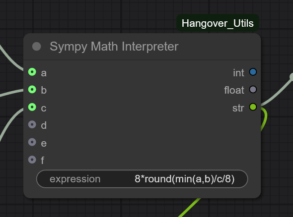
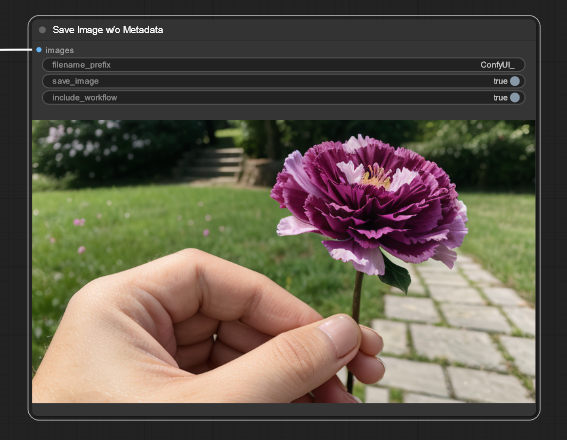
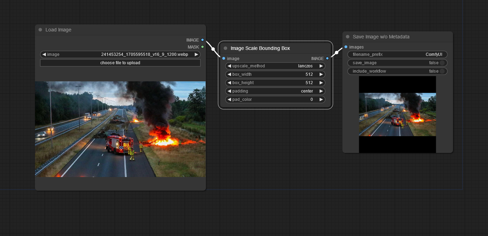
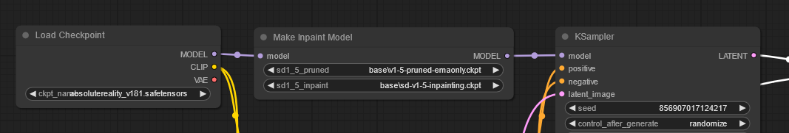

# Custom nodes for ComfyUI

## This repository fully replaces and extends the previous Hangover Nodes

[ComfyUI](https://github.com/comfyanonymous/ComfyUI) is the awesome stable diffusion GUI and backend.

**Please note that this repository is currently a (learning) work in progress and might change anytime.** It has been tested in Windows 10 only so far.

## Updates

* Removed: Microsoft Kosmos2 interrogator.
* New node: Sympy Math Interpreter 🆕

## Nodes overview:

- Powerful math in ComfyUI: Sympy Math Interpreter
- Stable Diffusion Privacy: Save Image with or without Metadata
- Scale an Image To A Bounding Box
- Easily make an inpainting version of any SD1.5 model

---

### Node: Sympy Math Interpreter

Based on [SymPy](https://www.sympy.org/en/index.html), this node brings powerful mathematical expression evaluation to ComfyUI. You can not only do + - * / pi E GoldenRatio but has also functions like round, min, max, sin, cos, exp, power, !, ... probably more than I am self aware of, and it can also do integration and differentiation. The node takes integer and float as input values.

#### Example expressions:

6 input variables are available (a, b, c, d, e, f)

* <code>round(a/b)</code>
* <code>min(max(a,b),c)</code>
* <code>diff(a*x**+b*x+c,x)</code> (symbolic differentiation)
* <code>diff(a*x**+b*x+c,x).subs({x:d})</code> (differentiate, substitute and evaluate at point d)
* <code>integrate(exp(-x**2),(x,a,b))</code> (numerical integrate from a to b)

See [Examples](examples/examples.md) [example workflow](examples/d__sympy.json)

---

### Node: Save Image w/o Metadata

With this custom save image node, you can preview or save, include or exclude the ComfyUI workflow metadata in the image. It is a derivation of ComfyUI's built-in save image node. Note that you can always right click on the image to save, it will also include the workflow if activated.

---

### Node: Scale Image To Bounding Box

This node scales an input image into a given box size, whereby the aspect ratio keeps retained. The image can also be padded to the full box size with an arbitrary color.

[See example outputs and workflows](examples/examples.md)

---

### Node: Make Inpainting Model for SD1.5

 This node easy creates an inpainting version of any SD1.5 model on the fly. No need to have GB's of inpainting models laying on your drive. This is very useful for any kind of inpainting nodes like detailers. Make sure you have the original SD1.5 models from [RunwayML](https://huggingface.co/runwayml) in your models folder:

- [v1-5-pruned-emaonly.ckpt](https://huggingface.co/runwayml/stable-diffusion-v1-5/blob/main/v1-5-pruned-emaonly.ckpt) or[v1-5-pruned-emaonly.safetensors](https://huggingface.co/runwayml/stable-diffusion-v1-5/blob/main/v1-5-pruned-emaonly.safetensors)
- [sd-v1-5-inpainting.ckpt](https://huggingface.co/runwayml/stable-diffusion-inpainting/blob/main/sd-v1-5-inpainting.ckpt)

They are needed for the calculation.

[See examples](examples/examples.md)

---

## Installation

Unzip or git clone this repository into ComfyUI/custom_nodes folder and restart ComfyUI.
