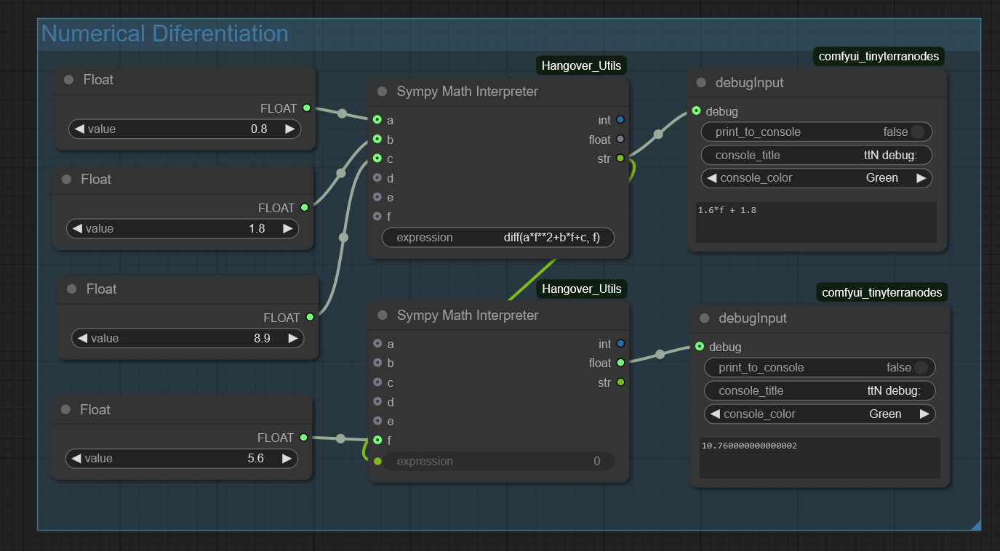
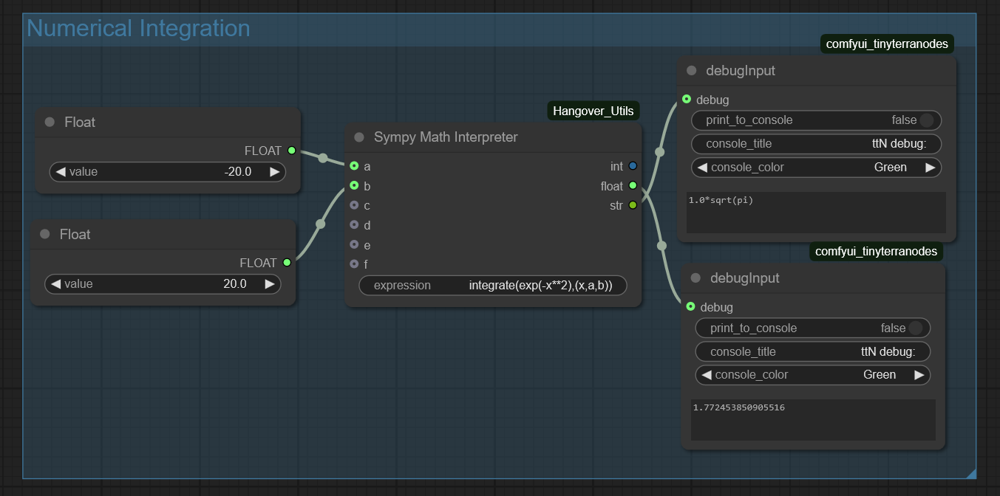
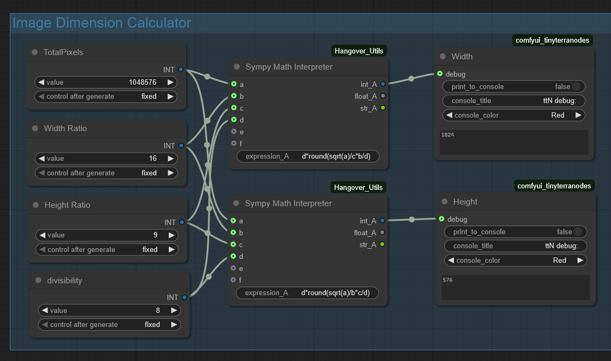
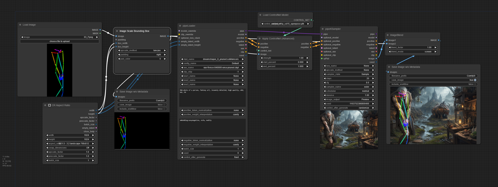
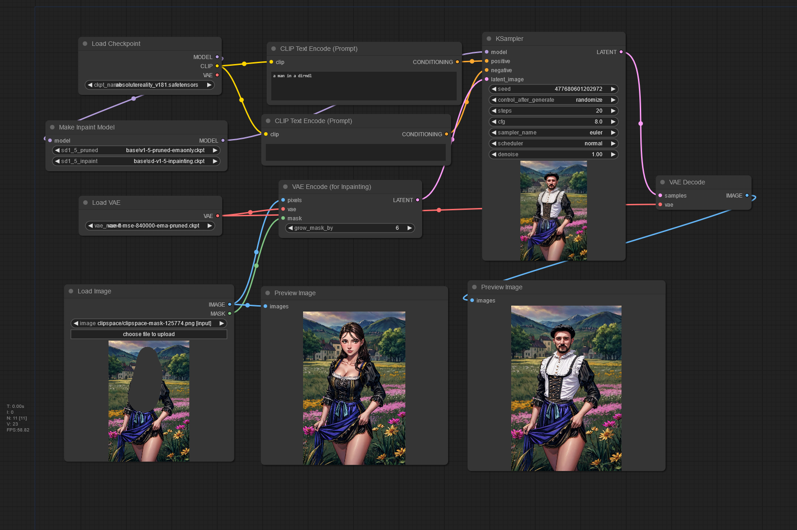

## Sympy Math Interpreter examples

[example workflow](d__sympy.json)

### Numerical derivation

Numerical 1st derivation of the second-degree polynomial `0.8*x^2+1.8*x+8.9` at the point `5.6`. With the first node, a symbolic first derivation is calculated, which is then evaluated by the second node at point `5.6`.

### Numerical integration

Numerical integration of the function `e^(-x^2)` within the limits `-20..20`

### Calculate image dimensions

---

## Image scale bounding box examples

 \
_Automatic fit an openpose image to the output image size_

---

## Make Inpainting Model example

 \
_Perfect inpainting with an appropriate inpainting model_
